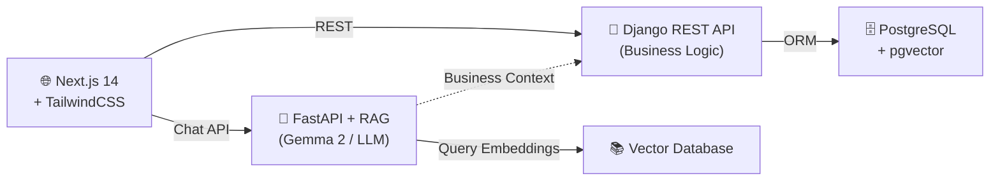

<div align="center">

# 🦷✨ Dental & AI Beauty Clinic Platform

**A unified platform for dental and beauty clinics — appointment booking, e-commerce for beauty products, e-prescriptions, and a custom RAG-based AI assistant.**

[](https://nextjs.org/)
[](https://djangoproject.com/)
[](https://fastapi.tiangolo.com/)
[](https://postgresql.org/)
[](https://docker.com/)
[](LICENSE)

</div>

---

## 📖 Overview

**Dental & AI Beauty Clinic Platform** is a full-stack, integrated solution that digitizes the entire workflow of a dental and beauty clinic — from booking appointments with specialists to purchasing beauty products online.

The platform combines an **appointment booking system**, **beauty product e-commerce**, **digital dental records**, and a **RAG-powered AI assistant** into a single ecosystem, serving three user roles: **Patients**, **Doctors**, and **Admins**.

### 🎯 Key Features

- 📅 **Smart Appointment System** — Book dental & beauty treatments with specialists
- 💊 **Dental e-Prescriptions** — Digital prescriptions linked to patient records
- 🛍️ **Beauty Product Store** — Browse, cart, and checkout beauty products
- 📄 **Digital Patient Records** — Dental charts, treatment history, and photos
- 🤖 **Custom AI Assistant** — Powered by RAG and the Gemma 2 model
- 📊 **Automated Dashboard** — Live stats on bookings, sales, and doctor performance
- 👥 **Multi-Role Access Control** — Admin / Doctor / Patient
- 📚 **Full API Documentation** — Auto-generated OpenAPI / Swagger docs

---

## 🏗️ Architecture



**Flow summary:**
- The **Next.js frontend** talks to the **Django REST API** for all business operations (appointments, orders, prescriptions).
- The **Django API** persists data in **PostgreSQL** (with **pgvector** for embeddings).
- For AI chat, the frontend calls the **FastAPI service**, which uses **Gemma 2** and queries the **vector database** for RAG context.

---

## 🧩 Tech Stack

| Layer | Technology |
|-------|------------|
| **Frontend** | Next.js 14 (App Router), TypeScript, TailwindCSS |
| **Backend Core** | Django 5 + Django REST Framework |
| **Backend AI** | FastAPI, LangChain, HuggingFace Transformers |
| **Database** | PostgreSQL 16 + pgvector |
| **AI Model** | Gemma 2 (via Ollama / vLLM) |
| **RAG** | pgvector + Multilingual Embeddings |
| **DevOps** | Docker, Docker Compose, Nginx |
| **Auth** | JWT + Role-Based Access Control (RBAC) |
| **API Docs** | OpenAPI 3 / Swagger UI / ReDoc |

---

## 👤 Roles & Panels

### 🧑‍🦱 Patient Panel
- Book dental and beauty appointments
- View dental records and treatment history
- Order beauty products from the store
- Receive and view e-prescriptions
- Chat with the AI assistant

### 🩺 Doctor Panel
- Manage appointments and working calendar
- Write dental records and e-prescriptions
- Upload treatment photos and X-rays
- Track performance and revenue

### 🛡️ Admin Panel
- Manage users, doctors, and clinic branches
- Manage beauty product inventory and orders
- Full analytics dashboard
- Manage RAG knowledge base content

---

## 🚀 Quick Start

### Prerequisites
- Docker & Docker Compose
- Node.js 20+
- Python 3.12+
- Git LFS (optional, for AI model)

### 1. Clone the repository

```bash
git clone https://github.com/alih982/dental-ai-beauty-clinic-platform.git
cd dental-ai-beauty-clinic-platform
```

### 2. Configure environment variables

```bash
cp .env.example .env
# Edit .env with your values
```

### 3. Download the AI model

Due to its size, the model file is not included in the repository. Choose one of the following methods:

**Option 1 — From HuggingFace:**
```bash
pip install huggingface-hub
huggingface-cli download google/gemma-2-9b-it --local-dir ai_service/app/ai_model/
```

**Option 2 — From Ollama (recommended):**
```bash
ollama pull gemma2:9b
```

**Option 3 — Use a lighter model:**
```bash
ollama pull gemma2:2b
```

### 4. Run with Docker

```bash
docker compose up -d --build
```

Then access the services at:

| Service | URL |
|---------|-----|
| 🌐 Frontend | http://localhost:3000 |
| 🔌 Django API | http://localhost:8000 |
| 🧠 FastAPI AI | http://localhost:8001 |
| ⚙️ Django Admin | http://localhost:8000/admin |
| 📚 API Docs (Swagger) | http://localhost:8000/api/docs |
| 📖 API Docs (ReDoc) | http://localhost:8000/api/redoc |

### 5. Manual Setup (Development)

**Backend (Django):**
```bash
cd backend/django_app
python -m venv .venv && source .venv/bin/activate
pip install -r requirements/dev.txt
python manage.py migrate
python manage.py createsuperuser
python manage.py runserver
```

**AI Service (FastAPI):**
```bash
cd ai_service
pip install -r requirements.txt
uvicorn app.main:app --reload --port 8001
```

**Frontend (Next.js):**
```bash
cd frontend
npm install
npm run dev
```

---

## 🔐 Environment Variables

See `.env.example` for the complete list. The most important ones:

```env
# ---------- Django ----------
DJANGO_SECRET_KEY=change-me-in-production
DEBUG=True
DATABASE_URL=postgresql://clinic:clinic_pass@db:5432/clinic_db

# ---------- JWT ----------
JWT_SECRET_KEY=change-me-too
JWT_ACCESS_TOKEN_LIFETIME=60
JWT_REFRESH_TOKEN_LIFETIME=1440

# ---------- AI ----------
AI_MODEL=gemma2:9b
OLLAMA_HOST=http://ollama:11434
RAG_ENABLED=false
EMBEDDING_MODEL=sentence-transformers/paraphrase-multilingual-MiniLM-L12-v2

# ---------- Frontend ----------
NEXT_PUBLIC_API_URL=http://localhost:8000/api
NEXT_PUBLIC_AI_URL=http://localhost:8001
```

> ⚠️ **Never** commit the real `.env` file.

---

## 📚 API Documentation

The platform exposes fully documented REST APIs via **OpenAPI 3.0**.

| Service | Swagger UI | ReDoc |
|---------|------------|-------|
| Django Core API | `/api/docs/` | `/api/redoc/` |
| FastAPI AI Service | `/docs` | `/redoc` |

### Authentication

All protected endpoints require a **JWT Bearer token**:

```bash
# Get access token
curl -X POST http://localhost:8000/api/auth/token/ \
  -H "Content-Type: application/json" \
  -d '{"username": "user", "password": "pass"}'

# Use it in requests
curl http://localhost:8000/api/appointments/ \
  -H "Authorization: Bearer <ACCESS_TOKEN>"
```

### Main Endpoints

| Method | Endpoint | Description |
|--------|----------|-------------|
| `POST` | `/api/auth/register/` | Register new user |
| `POST` | `/api/auth/token/` | Obtain JWT token |
| `GET` | `/api/doctors/` | List doctors |
| `POST` | `/api/appointments/` | Create a booking |
| `GET` | `/api/appointments/{id}/` | Appointment details |
| `GET` | `/api/products/` | List beauty products |
| `POST` | `/api/orders/` | Create a product order |
| `POST` | `/api/prescriptions/` | Create e-prescription |
| `POST` | `/api/ai/chat/` | Chat with AI assistant |

> Full interactive reference: **`/api/docs/`** after running the project.

---

## 🤖 AI Assistant (RAG)

The RAG system is implemented as a **potential feature** and can be activated by setting `RAG_ENABLED=true`.

- **LLM:** Gemma 2 (compatible with Ollama / vLLM)
- **Embeddings:** Multilingual (Persian + English)
- **Vector Store:** pgvector inside PostgreSQL
- **Sources:** Dental guidelines, beauty treatment references, clinic FAQ

### Activation

```env
RAG_ENABLED=true
AI_MODEL=gemma2:9b
```

Then index your documents:

```bash
python manage.py rag_index --source=clinic_docs/
```

---

## 📸 Screenshots

> Coming soon

| Patient Panel | Doctor Panel | Admin Panel |
|---------------|--------------|-------------|
|  |  |  |

---

## 📂 Project Structure

```
dental-ai-beauty-clinic-platform/
├── backend/
│   ├── django_app/           # Django REST API
│   │   ├── apps/
│   │   │   ├── accounts/     # Auth & roles
│   │   │   ├── doctors/      # Doctor management
│   │   │   ├── appointments/ # Appointment booking
│   │   │   ├── treatments/   # Dental & beauty treatments
│   │   │   ├── prescriptions/# E-prescriptions
│   │   │   ├── store/        # Beauty product store
│   │   │   ├── orders/       # Order management
│   │   │   └── patients/     # Patient records
│   │   └── manage.py
│   └── fastapi_ai/           # AI service
├── ai_service/               # Model & RAG
│   └── app/
│       ├── rag/
│       ├── embeddings/
│       └── chat/
├── frontend/                 # Next.js 14
│   └── src/
│       ├── app/
│       │   ├── (auth)/
│       │   ├── dashboard/
│       │   ├── store/
│       │   └── appointments/
│       └── components/
├── nginx/                    # Reverse Proxy
├── docker-compose.yml
├── .env.example
└── README.md
```

---

## 🗺️ Roadmap

- [x] Initial architecture & Docker setup
- [x] Authentication & RBAC
- [x] Appointment booking system
- [x] Beauty product store & orders
- [x] Dental records & e-prescriptions
- [x] Admin / Doctor / Patient dashboards
- [x] Full API documentation (OpenAPI / Swagger)
- [ ] Full RAG activation in production
- [ ] Payment gateway integration (Stripe / ZarinPal)
- [ ] Before/After photo gallery
- [ ] Mobile app (React Native)
- [ ] Unit & E2E tests
- [ ] CI/CD with GitHub Actions

---

## 🧪 Testing

```bash
# Backend
cd backend/django_app
pytest

# Frontend
cd frontend
npm run test
npm run test:e2e
```

---

## 🤝 Contributing

Please read [CONTRIBUTING.md](CONTRIBUTING.md) before submitting a PR.

Commit message conventions:

| Prefix | Purpose |
|--------|---------|
| `feat:` | New feature |
| `fix:` | Bug fix |
| `docs:` | Documentation changes |
| `style:` | Formatting |
| `refactor:` | Code refactoring |
| `chore:` | Maintenance tasks |
| `test:` | Adding tests |

---

## 📄 License

This project is licensed under the **MIT License** — see the [LICENSE](LICENSE) file for details.

---

## 📞 Contact

- **GitHub:** [@alih982](https://github.com/alih982)
- **Repository:** [dental-ai-beauty-clinic-platform](https://github.com/alih982/dental-ai-beauty-clinic-platform)

---

<div align="center">

**Built with ❤️ to improve dental & beauty care**

⭐ If you find this project useful, please give it a star!

</div>